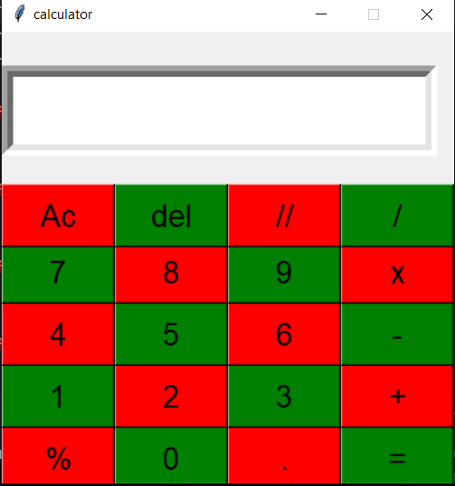

# Calculator App using Python Tkinter

A simple calculator application built using Python and Tkinter.

## Features
- Addition (+)
- Subtraction (-)
- Multiplication (x)
- Division (/)
- Floor Division (//)
- Modulus (%)
- Clear (AC)
- Delete (DEL)

## Technologies Used
- Python
- Tkinter

## Screenshot



## How to Run

```bash
python calculator.py
```

## Author
Rahul
